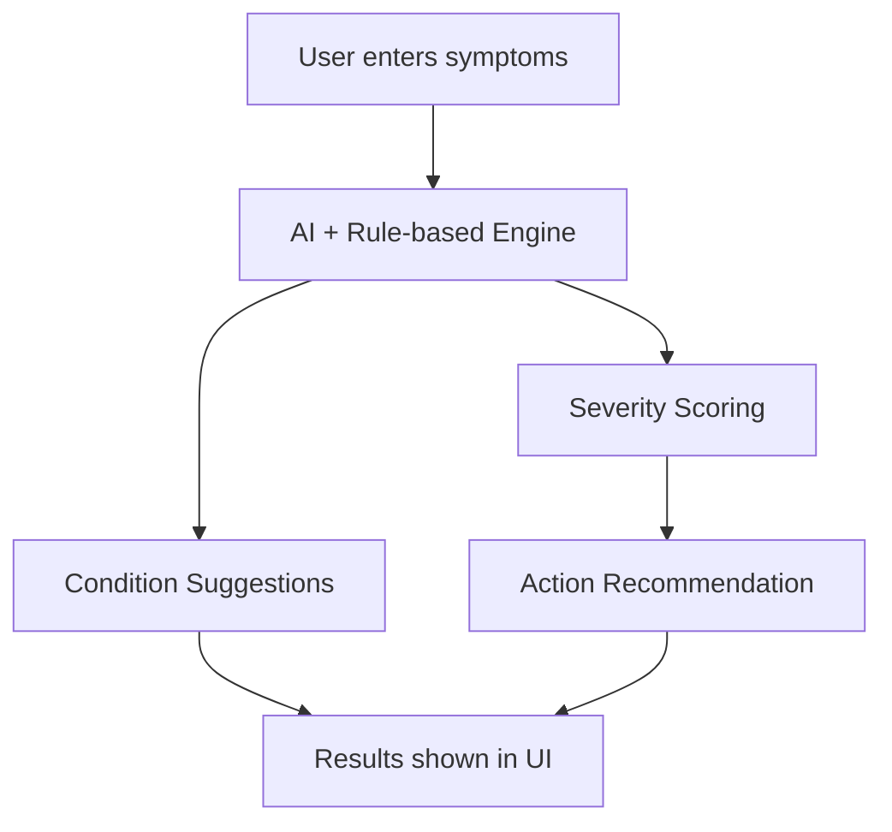

# 🏥 SymptoSense

*AI-Powered Symptom & Severity Checker*

> "Right care, at the right time – powered by AI."

 
 


---

## 📌 Overview

Healthcare decisions are often delayed because patients can't judge how serious their symptoms are. Some wait too long for critical conditions, while others panic and rush to hospitals unnecessarily.

*SymptoSense* is an AI-driven assistant that helps users:

* 🧾 Input their symptoms
* 🧠 Get possible conditions (non-diagnostic)
* 📊 Receive a severity score: *🔴 Critical | 🟠 Moderate | 🟢 Mild*
* ✅ Know the right next step: Emergency → Doctor Visit → Home Care

---

## 🔑 Key Features

* 🧠 *AI + Rule-Based Analysis* – safer and smarter than standard symptom checkers
* 📊 *Severity Scoring* – tells you when to worry and when not to
* 🌍 *Accessibility* – simple UI with future multilingual support
* 🔒 *Privacy-First* – user health data stays secure
* 📱 *Cross-Platform Ready* – Web app now, mobile app next

---

## ⭐ Unique Selling Proposition (USP)

Unlike generic symptom checkers that only show possible conditions, *SymptoSense*:

* Assigns *urgency levels* (Critical / Moderate / Mild)
* Gives *clear, actionable recommendations*
* Focuses on *local accessibility* (future multilingual support)
* Ensures *data privacy and trust*

💡 "SymptoSense doesn't just tell you what might be wrong — it tells you how urgent it is and what you should do next."

---

## 🛠 Tech Stack

* *Frontend:* React.js, Tailwind CSS
* *Backend:* FastAPI (Python) / Node.js (Express)
* *AI/ML:* OpenAI GPT, Medical symptom-condition ML models
* *Database:* MongoDB Atlas / PostgreSQL
* *Deployment:* Vercel (Frontend), AWS/GCP (Backend)

---

## 🔄 How It Works



*Example:*  
💬 Input → "Chest pain + sweating + difficulty breathing"  
📌 Output →

* Conditions: Heart Attack, Panic Attack, Asthma
* Severity: 🔴 *Critical*
* Recommendation: "Seek emergency care immediately."

---

## 📈 Why SymptoSense?

✔ Prevents *delayed emergency response*  
✔ Reduces *unnecessary hospital visits*  
✔ Provides *clear, easy-to-follow guidance*  
✔ Bridges *healthcare access gap* in underserved areas

---

## 🔮 Roadmap

* 🎙 Voice-based input
* 🌍 Multilingual support
* ⌚ Wearable device integration (HR, BP, SpO₂)
* 📱 Mobile app development
* 🤖 Enhanced AI with more accurate symptom analysis

---

## 🚀 Getting Started

### Prerequisites

- Node.js (v16 or higher)
- npm (v8 or higher)

### Installation

1. Clone the repository:
   ```bash
   git clone https://github.com/your-username/symptosense.git
   cd symptosense
   ```

2. Install dependencies:
   ```bash
   npm install
   ```

3. Start the development server:
   ```bash
   npm run dev
   ```

4. Open [http://localhost:5173](http://localhost:5173) in your browser.

---

## 🤝 Contributing

Contributions are welcome! Please follow these steps:

1. Fork the repository
2. Create a new branch (`git checkout -b feature/amazing-feature`)
3. Commit your changes (`git commit -m 'Add some amazing feature'`)
4. Push to the branch (`git push origin feature/amazing-feature`)
5. Open a Pull Request

---

## 📜 License

This project is licensed under the MIT License - see the [LICENSE](LICENSE) file for details.

---

## ⚠️ Disclaimer

SymptoSense is not a substitute for professional medical advice. It offers guidance and triage recommendations only. Always consult a licensed doctor for diagnosis and treatment.

---

## 🙏 Acknowledgments

- Icons by [Font Awesome](https://fontawesome.com/)
- UI Components by [Headless UI](https://headlessui.com/)
- Icons by [Heroicons](https://heroicons.com/)
